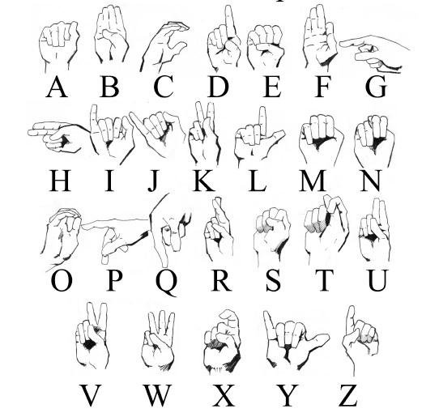
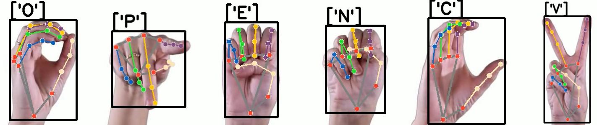

#### Sign Language Alphabet Recognition
This GitHub repository contains an American Sign Language (ASL) alphabet detector. The detector uses mediapipe and opencv to recognize and classify hand gestures representing the 26 letters of the ASL alphabet. The model was trained on a dataset of images of hand gestures and the corresponding ASL letters. The code provide an end-to-end solution for anyone interested in developing a similar project, from data preprocessing to model training and evaluation.

#### Requirements:
* [NumPy](http://www.numpy.org/)
* [OpenCV](https://docs.opencv.org/4.x/)
* [Matplotlib](http://matplotlib.org/)
* [Scikit-Learn](https://scikit-learn.org/stable/getting_started.html)
* [MediaPipe](https://mediapipe.dev/)

#### Datasets i used:
[Synthetic ASL Alphabet - Kaggle](https://www.kaggle.com/datasets/lexset/synthetic-asl-alphabet)  
[American Sign Language Letters Dataset - RoboFlow](https://public.roboflow.com/object-detection/american-sign-language-letters)

#### The model had a ~98% accuracy on the test set, although when the model was used on videos instead of images a few problems came out:
#### - the letter 'S' was usually mistaken with the letter 'N'
#### - the letter 'M' was sometimes mistaken with the letter 'E'
#### - the letter 'J' requires hand movement and since the model was trained only on images it is often mistaken with 'I'

#### Example:

